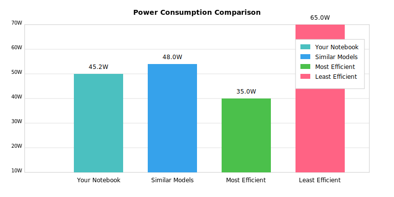

# Notebook NILM Power Monitor

A sophisticated web application that monitors your notebook's power consumption using Non-Intrusive Load Monitoring (NILM) techniques and AI to analyze energy usage patterns. The system compares your notebook's power consumption with other models using publicly available datasets.


## Features

- **Real-time Power Monitoring**
  - Live power consumption tracking
  - Interactive charts and visualizations
  - Device state detection (Idle, Light Usage, Normal Usage, etc.)

- **NILM Analysis**
  - Power consumption pattern recognition
  - Device state classification
  - Usage trend analysis

- **Comparative Analysis**
  - Comparison with similar notebook models
  - Efficiency benchmarking
  - Power usage recommendations

- **Security**
  - Google OAuth2 authentication
  - Secure data transmission
  - User-specific monitoring

## System Requirements

- Node.js 14.x or higher
- NPM 6.x or higher
- Arduino or similar microcontroller
- Current sensor (e.g., ACS712)
- Google account for authentication

## Hardware Setup

### Components Needed
- Arduino/microcontroller
- Current sensor (ACS712 or similar)
- Connection cables
- USB cable for Arduino

### Connection Diagram
```
Notebook Power Supply -> Current Sensor -> Arduino -> USB -> Computer
```

## Installation

1. Clone the repository:
```bash
git clone [repository-url]
cd notebook-nilm-monitor
```

2. Install dependencies:
```bash
npm install
```

3. Configure environment variables:
Create a `.env` file in the root directory:
```env
GOOGLE_CLIENT_ID=your_client_id
GOOGLE_CLIENT_SECRET=your_client_secret
SESSION_SECRET=your_session_secret
SERIAL_PORT=COM3
```

4. Start the server:
```bash
npm start
```

## Google OAuth2 Setup

1. Go to [Google Cloud Console](https://console.cloud.google.com)
2. Create a new project
3. Configure the OAuth consent screen
4. Create credentials (OAuth 2.0 Client ID)
5. Add authorized origins and redirect URIs:
   - `http://localhost:3000`
   - `http://localhost:3000/auth/google/callback`

## Usage Examples

### Real-time Monitoring
The system provides real-time power consumption monitoring with interactive charts:


### Comparative Analysis
Compare your notebook's power consumption with other models:



### Device State Detection
The system automatically detects and displays your notebook's current state:

- Idle (< 5W)
- Light Usage (5-15W)
- Normal Usage (15-30W)
- Heavy Usage (30-50W)
- Maximum Performance (> 50W)

## Development

For development with hot-reload:
```bash
npm run dev
```

## Data Analysis

The system uses several techniques for power analysis:

- Statistical analysis (mean, median, standard deviation)
- Trend analysis using linear regression
- Pattern recognition for device states
- Comparative analysis with reference datasets

## Contributing

Contributions are welcome! Please read our [Contributing Guidelines](CONTRIBUTING.md) for details on our code of conduct and the process for submitting pull requests.

## Security

- All credentials are securely stored
- Authentication is handled by Google OAuth 2.0
- Data is transmitted securely using HTTPS
- Session management with secure cookies

## License

This project is licensed under the MIT License - see the [LICENSE](LICENSE) file for details.

## Acknowledgments

- Thanks to the NILM community for research and datasets
- Arduino community for hardware interfacing examples
- Node.js and Express.js communities

## Support

For support, please:
1. Check the [Issues](issues) section
2. Review existing documentation
3. Create a new issue if needed

## Roadmap

- [ ] Add support for multiple sensors
- [ ] Implement advanced ML algorithms
- [ ] Add database support for historical data
- [ ] Create detailed power usage reports
- [ ] Add support for more notebook models
- [ ] Implement power-saving recommendations
